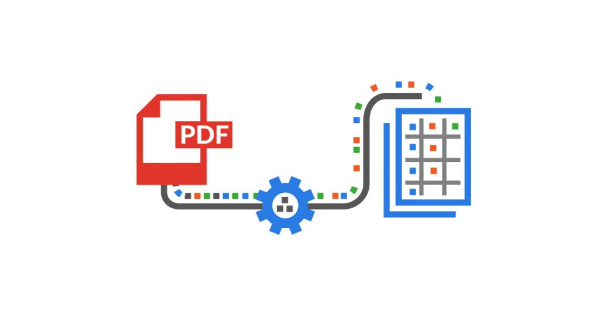

# PDF Scraping App



## Overview

This is a PDF scraping application that can extract information from various types of PDF reports. The app is powered by LLM (Language Model) and uses different libraries and tools to parse, analyze, and provide answers to specific questions related to the PDF content. It utilizes OpenAI's language model (text-davinci-003) for question-answering tasks and LangChain for text processing and embeddings.

## How to Use

1. **Install Dependencies**: Before running the application, ensure you have the required dependencies installed. You can install them using the following command:

pip install streamlit pandas pillow PyPDF2 streamlit_extras langchain

markdown
Copy code

2. **Running the App**: To start the application, execute the Python script `app.py`:

streamlit run app.py

vbnet
Copy code

3. **Sidebar Contents**: Upon running the app, you will see a sidebar displaying details about the application and an image related to PDF parsing.

## Features

- **PDF File Selection**: The app is currently set to process a specific PDF file named `tsla-def14a_20220804-gen.pdf`. You can modify the `pdf_file` variable in the code to use a different PDF file.

- **PDF Text Chunking**: The PDF file's text is divided into smaller chunks for efficient processing using the RecursiveCharacterTextSplitter. This step prevents limitations imposed by certain language models.

- **Embeddings and Vector Store**: OpenAIEmbeddings are used to create embeddings of the text chunks, which are stored in a vector store created using FAISS. The vector store facilitates similarity searches for answering questions related to the PDF content.

- **Question Answering**: The app can answer specific questions related to the PDF content. For example, it can extract information from the "SUMMARY COMPENSATION TABLE" by providing specific column headers. OpenAI's language model generates answers based on the information stored in the vector store.

- **JSON Output**: The answers generated by the app are returned in JSON format, providing structured information.

- **Executives Selection**: After processing the PDF and generating answers, the app allows you to select executive officers from the available data and view their compensation details in a DataFrame.

- **JSON Storage**: The app saves the JSON data containing answers to a file named `{store_name}.json`, enabling access to the information without reprocessing the PDF.

## Important Note

Please be aware that this app uses the OpenAI language model, which may incur costs depending on usage. Make sure to review and understand the pricing details of the language model and other services used in the app before extensive usage.

Remember to replace the `pdf_file` variable with the path to your desired PDF file if you want to use this app for different PDF reports.

## Example Usage

```python
# Run the main function with the desired PDF file name (without the extension) as an argument
main('tsla-def14a_20220804-gen')
License
This project is licensed under the MIT License. Feel free to use and modify this app as per the terms of the license.

Contact
For any questions or suggestions, feel free to contact me at your.email@example.com.

Happy PDF scraping!
